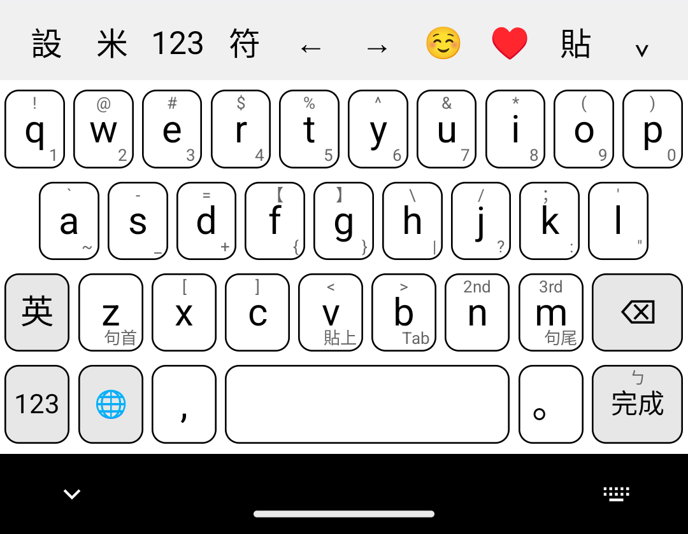
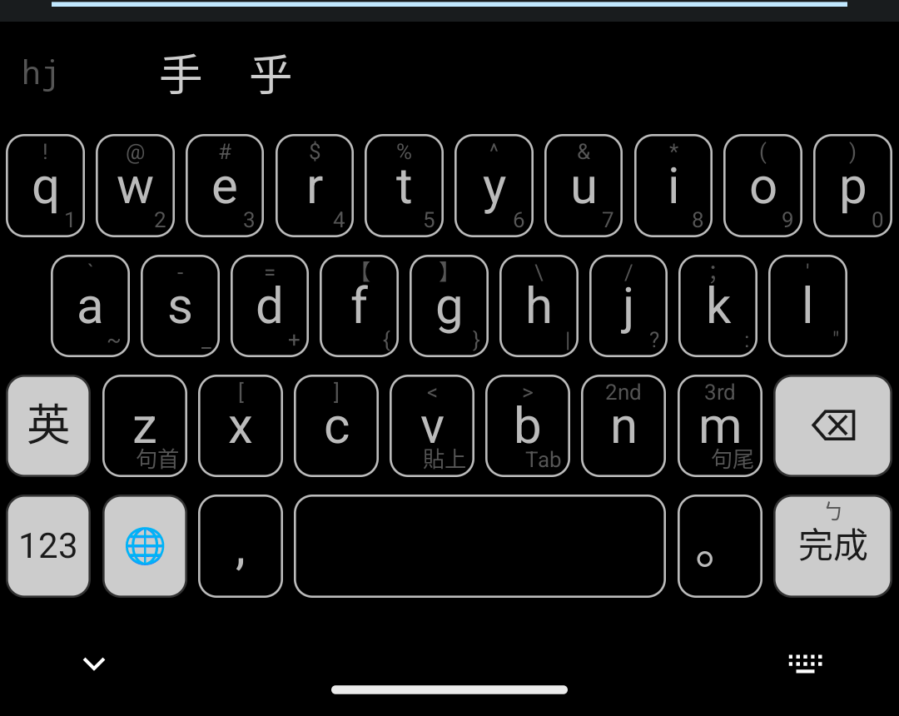

<p align="center">
  
</p>

# OhMyBias 米 Android

Android 嘸蝦米（Boshiamy）鍵盤 — [ohmybias-ios](../ohmybias-ios) 的 Android 移植版
（引擎層一對一對應，源自 [Yabomish](https://github.com/plateaukao/yabomish)）。
純 Kotlin、零第三方執行期依賴。

<p align="center">
  <br>
  
</p>

## 特色

### 輸入引擎

- **嘸蝦米輸入**：匯入自己的 `liu.cin`，on-device 編譯 mmap 零拷貝載入（CINM 格式與 iOS 版相同，檔案可互通）
- **基本聯想詞**：commit 後即出現詞組聯想（萌典詞組，CC0，僅 687KB）＋自訂詞（user_phrases.txt）
- **字頻學習**：freq.db 依使用習慣排序候選；`,,PIN` 固定同碼字排序
- **`,,` 指令**：`,,T/S/J` 切模式、`,,ZH` 注音查碼、`,,TO` 同音字、`,,PYS/PYT` 拼音查碼、`,,SG` 聯想開關、`,,V/VT/VS` 剪貼簿（ICU 簡繁轉換）、`,,H` 說明
- **極簡資料**：不含專業詞典／語料 binary（<2MB）

### 鍵盤介面（以 sweetlime 皮膚為藍本，與 iOS 版一致）

- **滑動手勢**：鍵帽角標提示 — 上滑出符號、下滑出數字；`n`/`m` 次選、三選直接上屏；空白上滑切中英、水平拖曳移動游標；Enter 上滑跳注音頁；`z`/`m` 下滑句首句尾、`v` 下滑貼上
- **長按選單**：字母大小寫／變音變體、逗號句號長按插入日期時間（中文／民國／日本／英文／農曆／時區，android.icu 曆法）
- **工具列與面板**：設定、♥ 常用語面板、符號／Emoji／顏文字分類面板、語言鍵顯示目前模式（米／英）、游標左右、貼上、收折
- **多頁鍵盤**：字母、九宮格數字、Row 數字半形符號、全形符號、注音查碼
- **主題**：淺色／深色調色盤；可匯入 `.cskin` 皮膚設定（工具列、調色盤、字級、版面選項）
- **記住中英模式**：鍵盤重啟後還原上次輸入模式

## 安裝

1. `./gradlew assembleDebug` 後安裝 `app/build/outputs/apk/debug/app-debug.apk`
2. 開 OhMyBias 米 app → 匯入 `liu.cin`
3. 系統設定 → 螢幕鍵盤 → 啟用「OhMyBias 米」，並切換為目前輸入法

> ⚠️ `liu.cin` 為行易公司版權字表，請自備，本專案不含亦不得散布。

## 開發

```bash
./gradlew assembleDebug        # 建置 APK
./gradlew testDebugUnitTest    # 引擎測試（JVM，無需模擬器）
```

## 專案結構

```
app/src/main/java/info/plateaukao/ohmybias/
  shared/      # 平台無關引擎（對應 iOS Shared/；禁止 Android API）
  keyboard/    # IME service、鍵盤五頁、候選列、面板、主題、手勢
  android/     # SQLite 字頻、SharedPreferences、剪貼簿（ICU）、Application
  MainActivity # 設定頁（匯入字表/皮膚、偏好、自訂詞、測試輸入）
app/src/main/assets/   # phrases.bin（萌典）、s2t/t2s、zhuyin/pinyin/char_freq
app/src/test/          # JUnit 引擎測試（移植自 iOS Tests/）
```

## 資料來源與授權

| 檔案 | 來源 | 授權 |
|------|------|------|
| `phrases.bin` | [萌典](https://www.moedict.tw/)（教育部國語辭典） | CC0 |
| `zhuyin_data.json` / `pinyin_data.json` / `char_freq.json` | Yabomish 上游整理 | 同上游 |
| `s2t.json` / `t2s.json` | Yabomish 上游整理 | 同上游 |
| 鍵盤版面／符號分類 | Hamster 2 皮膚「蝦米輸入法」（sweetlime.cskin，作者 Ryan）移植 | 見原皮膚 |
